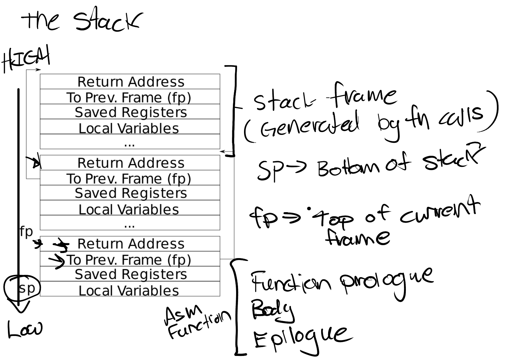

# Lab Traps
## Lecture Note
### State of CPU

Try thinking the CPU as a state machine. When context switch happens, actually we change the _state_ that describes the CPU. And the state includes the following stuffs.
- 32 general purpose registers, including the SP
- PC (program counter)
- MODE (user/supervisor)
- SATP
- SSCRATCH/STVEC/SEPC (Trap related)

When a trap like system call happens, the state actually remains to be user mode, but we need to execute the kernel function, thus entailing a state change. There are two goals, transparently handling the trap and saving from user's potential malicious actions. To do so, we need to save several infos, like the general registers, PC, MODE and SATP (**SP is needed because kernel C function needs a stack to execute**). 

> What can supervisor mode do for real?

1. Modify the control registers, like SATP/SEPC/STVEC
2. Execute the PTE **without** `PTE_U` flag
3. **Can not** escape from VA. Namely even supervisor can not directly visit PA

### Process of a trap
#### User mode trap
The whole process can be described in the following steps. Take system call as an example.

1. First the system call assembly (User space ) is as follow. `ecall` will change the state.
```Assembly
li a7, SYS_write
ecall
ret
```
2. `Uservec` Code at the trampoline page starts to execute.
3. `Usertrap` code in `trap.c` starts to execute.
4. Real system call handler will be called.
5. `Usertrapret` code in `trap.c` starts to execute.
6. `Userret` Code at the trampoline page starts to execute.
7. DONE!

***We are going to look into each step in order.***

##### Uservec

> What does `ecall` do?

- Change the mode to supervisor mode.
- Save the current PC to `SEPC`.
- Jump to where `stvec` points to.

We should remind that `ecall` **will not change `satp`**, so in the supervisor mode, the `satp` is still the user page table. So the address that `stvec` points to must has its mapping in the page table, which is called `TRAMPOLINE`. Note that `PTE_U` flag of trampoline is not set, in order to prevent access from user mode.

All user processes must have the same mapping of trampoline. Since we set `stvec` to a constant. Same reason for kernel processes.

> Why does not `ecall` do the stuffs like saving registers?

Leave flexibility to OS designer. Probably under certain circumstances, we do not need to save all registers, or switch to kernel page table.

> How to save registers?
- Since we do not know where the kernel page table is, and we do not have a spare register, we can not directly save to particular physical address.
- Kernel makes sure every process has a trap frame in user page table and info can be recorded there.

> How to solve the problem of no spare registers?

xv6 provides a register called `sscratch` and it is initially set to the virtual address of trap frame. Then we can use `csrrw` instruction to swap two registers (typically a0). Then we can use `a0` as the base address, and particular offset to store value.

Before we return back to user code, we need to ensure that `sscratch` still has the value of trap frame, but simply swapping again `a0` and `sscratch` is wrong. Because `a0` may be changed. So in `trap.c:130`, **we manually enforce a function call to store the parameter into `a0, a1` registers**.

> Why setting registers like `tp`, `sp` in `uservec`

Because we need to execute C program later, so we need a kernel stack, which `sp` points to.

We need an ID to sign the core we are running on, thus `tp`.

> We change `satp` into kernel page table in `trampoline.S:78`. Why no crash?

Trampoline has the same VA to PA mapping in both kernel and user page table. `pc` is not changed. Thus in the two page table, the PA of current instruction are the same.

##### Usertrap
First, we set the `stvec` to kernel vector in line 49. Because we are now in the kernel,
and we are using the kernel page table. So instructions in `uservec` may be redundant and wrong.

Second, we save the `sepc` again into trap frame. Because the handler may call another system call, and 
overwrite the `sepc` register.

Last, we call `syscall()` to really handle the system call. We will use the `a7` register in the trap frame, 
since it is the id of system call.

##### Usertrapret

We are about to finish the trap and return back to user space. But currently we 
are in the kernel and are using the kernel vector and kernel page table. 
We need to reset the `stvec` to uservec, and shut down interrupt until we are back to user space.

> Why can't we change `satp` now?

Because only trampoline has the same mapping in two page table, so switching can only
happens there.

Then we recover several registers like `sepc` and `sstatus`.

We are about to go to trampoline again. But two things are left. 
Remember we need to set the `satp` in trampoline, and to ensure that 
`sscratch` always ends with the address of trap frame. We need to 
pass the value. Here, we take advantage of C programming language, that will
put the parameter in `a0` and `a1` registers.

##### Userret

Just change to user page table and recover all the registers.

> What does `sret` do?

Set `pc` to `sepc`, and `SIE` to `SPIE`.

> Why does we need assembly?

C compiler can optimize the code. So any modification related with REGISTERS 
should be done in assembly.


### Page Faults
The page table enables isolation between processes, and kernel's full control over VA to PA transition. But the mapping is kinda static. We want to dynamically utilize some traps to control the page, which is **page fault**.

> Page Fault is just a kind of trap, just different from other traps from the type stored in `scause`. The handling process is about the same.

What info do we need to handle page fault?
- **stval**: to store the _faulting VA_
- the type of page fault in `scause`
- other basic info like `sepc` (because page fault needs to resume after repairing the page fault)

#### Lazy Allocation
Used in `sbrk()` for dynamically allocation memory on the heap.

> `process->sz` records the size of current process, also the top of the heap area. (Because stack, data, text part are fixed.)

What `sbrk()` do is just increment the `process->sz` by given amount, but do not physically allocation page for that. (VA >= process->sz will be considered error.)
If an instruction visit the new area, a page fault will be triggered.
**And the OS will allocate and zero a new page, do the mapping and resume the instruction**.

> Page Fault is included in **Trap**. So it follows the routine in [this link](#user-mode-trap). 

#### Zero Fill On Demand

In the `BSS` segment, all variables are not initialized and be set to zero. We don't need to allocate a physical page for BSS virtual page. In fact, we can allocate only **one** physical page that is zero-valued, and map all the BSS page into the physical page with **read-only** permission. 

When we want to assign a value to BSS variable, a page fault is triggered. A new physical page will be allocated with R/W permission, pte will be assigned and instruction will be resumed.

#### Copy-On-Write Fork

A eager version of fork is to copy the whole page of father process as soon as `fork()` is called. But given that `exec()` usually follows `fork()`, so the page we copied will be replaced soon, which is costly.

So, lazy it.

When we call `fork()`, we just set the exact mapping of child process as father process. But the pte only has read permission. When we write the child/father process, a page fault is triggered. Then we copy the initial page, map it in child/father page table, set both mapping into R/W permission, and resume.

#### Demand Paging
Focusing on `exec`

A eager version of `exec` is to load all text, data and segment as soon as `exec` is called. It is very slow when data is large. 

So, lazy it.

When we call `exec()`, we will **NOT** load all infomation into the memory. When we meet a page fault (missing page), then we load it from file/disk, set the mapping and resume.

Then a problem comes. What if we does not have enough space for further pages? We need to evict some of them. A common method is to evict based on least recently used principle. (Access bit will be referenced.)

Notice that access bit will be reset at a regular time period.

> Eviction will be inclined towards dirty or non-dirty page?

Non-dirty. Since we need to write back dirty page during eviction. Further overhead.

#### Memory Mapped File

Use load and save instead of read and write to visit a file.

A typical interface is to map particular va range to certain offset range in a file descriptor. Then r/w from the va is equivalent to file manipulation. (All effects will take place when OS writes the page back into the file.)

Still, we can utilize page fault to lazy load as [demand paging](#demand-paging).

> Why is `mmap` faster?

Because when we use `open()` to start manipulating a file, we can only use `read/write()` interface, which entails great user/kernel transition overhead. 

But with `mmap()`, we just need one. After loading into memory, we can use user-level load method to visit the file.

#### MISC

The `RSW bit` in pte can be used to signify the cause of page fault, such as cow fork, demand paging, etc.


## Lab Note

### Backtrace
Backtrace is to print the calling frame in the current stack.

We need to follow the routine of frame in a stack. Check 

`sp` points to the top of current stack, and `fp` points to the top of current frame. The `ra` and `prev frame pointer` are at fixed offset from `fp`, -8 and -16. We can iterate through previous frame pointer until it reaches the top of the page.

Remember stack grows down, from high address to low address.

> How to read the 8 byte starting from a given address?

We can assign it to a `unsigned long *` pointer, dereference and assign the value to a `unsigned long` variable.

### Alarm
#### test0
Our task is to successfully invoke the handler. Before we start, we need to figure out the pipeline.

`sigalarm` is a register function. It tells the kernel that we need to add alarm for current process. **It does not call the handler.**

The alarm is triggered by **timer interrupt**. When it reaches given number, the handler function will be called.

At the end of each handler function, `sigreturn` is called to reset and resume instruction executed before.

We need to add entry in `struct proc` to record the upper bound, current stick and address of handler function.

The key point is how to invoke the handler!!!

A direct way is to invoke by kernel. But when executing `usertrap` in `trap.c`, we are actually in kernel page table. And the handler address is based on user virtual address. We can not guarantee the va has a corresponding mapping in kernel page table. 

A better way is to use `sepc`. Remember that in `usertrapret()`, we will at last set the current pc to `p->trapframe->epc`. **That is where the program will resume at and it is translated via USER page table.** _So we can just modify the epc in trapframe to be our handler address._

#### test1
A problem is that after we execute the handler, we don't know the place to resume. Thus, we need further information backup. Let's figure out how many variables we need to record.

> Case 1. Timer interrupt, but does not reaches upper bound.

The flow is uservec to usertrap to trap.c:83 (`which_dev == 2`) and just yield. Everything is as usual.

> Case 2. Timer interrupt, but reaches upper bound.

uservec to usertrap to trap.c:83 (`which_dev == 2`) and to `if` block starting from line 84. In there, we will change the `epc` on `trapframe` to be the handler. **So we need to backup previous epc to resume.** In the handler, the current process will use the whole registers. But the trapframe at this point still keeps track of what the registers are at the very beginning, except the epc. However, at the end of handler, there is another system call `sigreturn`. In the trap handling pipeline, the trapframe will be overwritten. **So we need to keep track of the whole trap frame.**

Since `epc` is included in `trapframe`, just allocate a new backup trapframe is enough.

In case we re-enters the handler, we can user a flag to note whether we are executing the handler, and reset it at the end of `sigreturn`.

> What is the resume position? sepc or sepc + 4?

Different from `ecall` in system call, we do not need to add 4 to sepc. Because the code is interrupted by timer (not by current instruction), so the current position is the place to resume.